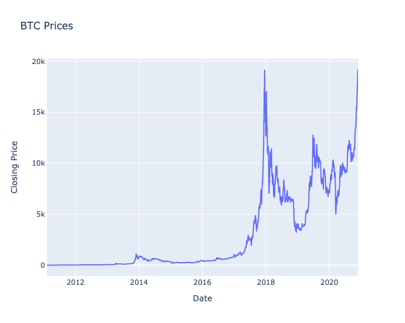
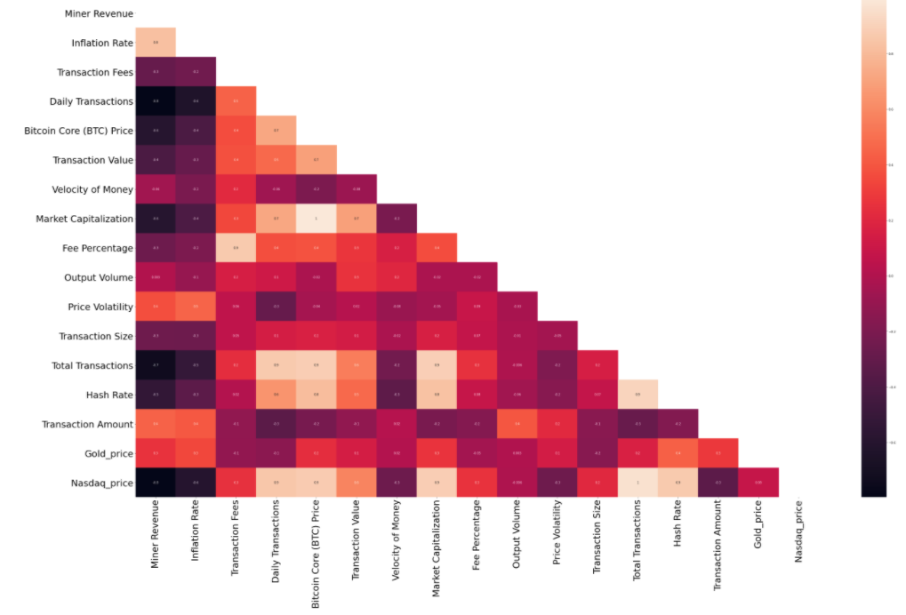
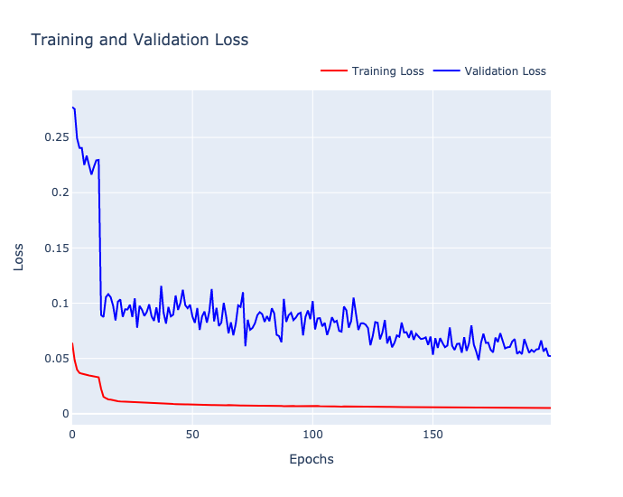
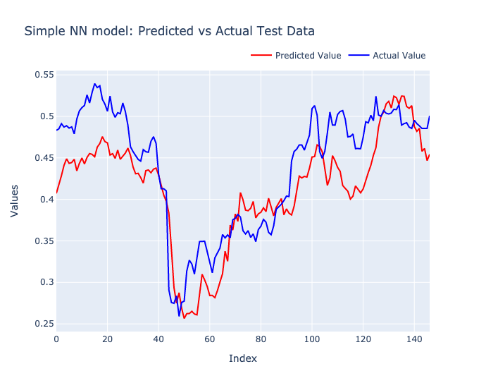
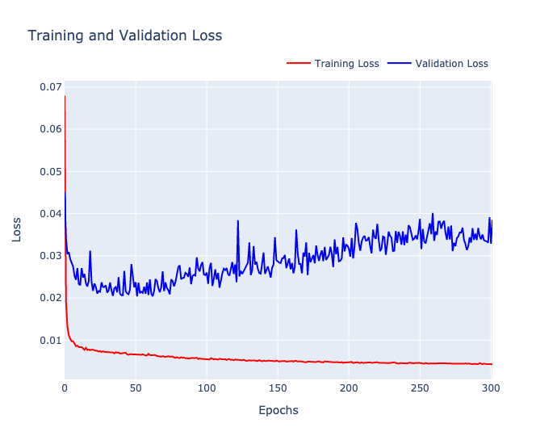
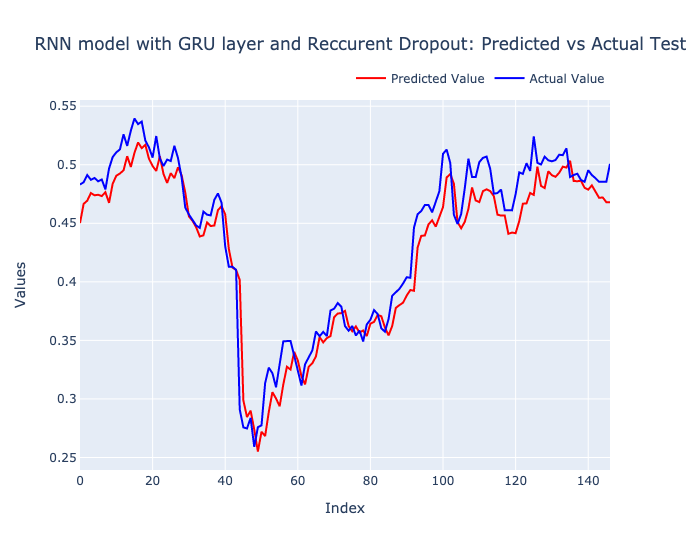
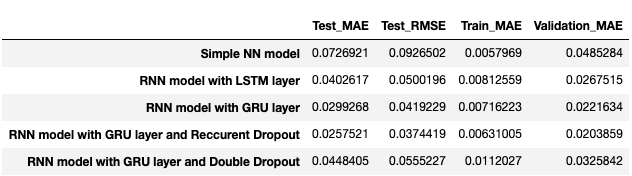

# Multivariate Multi Step Time Series modelling using GRU layer and recurrent dropout
Predicting the re-rise of bitcoin prices using Recurrent Neural Networks and optimising the model using GRU and dropout layers. 
## Objective 
Objective of the project was to build a bitcoin price prediction model.

## Data Collection  
### Web Scraping Bitcoin.com using Selenium and Python : https://github.com/Shreyav29/WebScrapingBitcoin.com
In this project I am trying to scrape the Bitcoin.com website and download various parameters belonging to the Bitcoin cryptocurrency. I am going to use this data in a bitcoin price prediction project later.

### Scraped Features
Bitcoin Core (BTC) Price, Market Capitalisation, Price Volatility, Daily Transactions,Transaction Value,Total Transactions,Fee Percentage , Transaction Amount, Hash Rate, Transaction Fees, Miner Revenue, Inflation Rate, Transaction Size, Output Volume, Velocity of Money
I also considered other external factors like price of gold and S&P prices so that we know how the market is trending.

## Feature Scaling 
First I performed data cleaning and then normalised the data so that we are not effected by the scale of the data points as we know bitcoin is very volatile.

## Model Development 
### Model Setup
As this is the sequence model. I assumed the past 28 days of data would be affecting next 7 days of data. So the input for the model will be 28 days data and the output would be the next 7 days.

### Simple Neural Network 
Even though this is a sequential model , just to test , I started off with a simple 2 dense later NN where I flattened the data to get the vectorised outputs.

### RNN model with LSTM layer vs GRU Layer 
Then I moved on to implement a simple RNN with a LSTM hidden layer and a GRU hidden layer. We found that GRU was giving a better
### RNN model with GRU layer and recurrent dropout 
Then we added a recurrent dropout which further improved the model . I also used a early stopping condition which stopped the model from overfitting to the data.

## Model Evaluation 
I evaluated  the models based on the Mean absolute error and RMSE
Finally to find the accuracy of our model, considering the fact that bitcoin is very volatile, I took a range of 1% around the bitcoin price and saw in how many days our prediction was inside that range. This turned out to be around 90% accurate 

